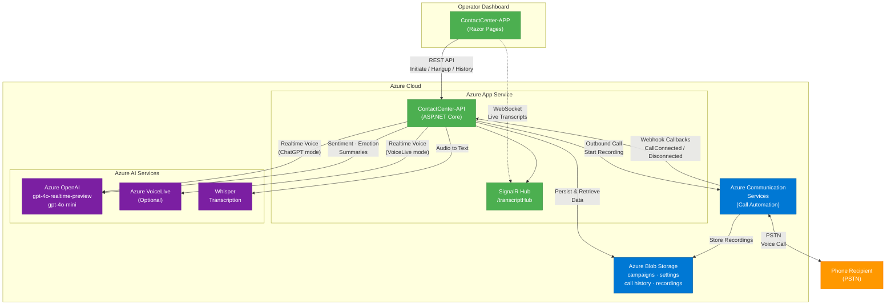

# Azure AI Contact Center

An AI-powered contact center proof-of-concept built with .NET 9, Azure Communication Services, and Azure OpenAI. The solution initiates outbound phone calls where an AI agent converses with the recipient in real time, then provides sentiment analysis, emotion detection, and call summaries.

## Features

- **Outbound AI Calls** — Initiate phone calls to real phone numbers with an AI agent that speaks and listens in real time
- **Dual Voice Modes** — Choose between Azure OpenAI Realtime (ChatGPT) or Azure VoiceLive for the AI voice
- **Real-Time Transcription** — Live transcript streaming to the dashboard via SignalR
- **Sentiment & Emotion Analysis** — Post-call analysis classifying sentiment (Positive/Neutral/Negative) and emotion (Happy, Frustrated, Angry, Sad, Anxious, Neutral)
- **Call Summaries** — AI-generated executive summaries of each conversation
- **Campaign Management** — Define campaigns with custom AI behavior instructions
- **Call History** — Browse past calls with full transcripts, recordings, and analytics
- **Configurable Settings** — Adjust voice selection, call time limits (0.5–30 min), and transcription modes

## Architecture



## Prerequisites

- [.NET 9 SDK](https://dotnet.microsoft.com/download/dotnet/9.0)
- An Azure subscription with the following resources provisioned:

| Azure Service | Purpose | Required |
|---|---|---|
| **Azure Communication Services** | Outbound PSTN call automation and recording | Yes |
| **Azure OpenAI** | Realtime voice conversations (`gpt-4o-realtime-preview`), chat analysis (`gpt-4o-mini`), and Whisper transcription | Yes |
| **Azure Storage Account** | Persist campaigns, settings, call history, and recordings | Yes |
| **Azure App Service** (×2) | Host the API and the frontend app | For deployment |
| **Azure VoiceLive** | Alternative high-quality realtime voice engine | Optional |

### Azure OpenAI Model Deployments

You need the following deployments in your Azure OpenAI resource:

| Deployment Name | Model | Purpose |
|---|---|---|
| `gpt-4o-realtime-preview` | gpt-4o-realtime-preview | Realtime voice conversations (ChatGPT mode) |
| `gpt-4o-mini` | gpt-4o-mini | Sentiment analysis, emotion detection, call summaries |

### Azure Communication Services Setup

1. Create an ACS resource in the Azure Portal
2. Purchase a phone number with **outbound calling** capability
3. Note the **connection string** from the resource's Keys blade
4. The phone number must be in E.164 format (e.g., `+14255550123`)

## Configuration

### API Configuration (`ContactCenter-API/appsettings.json`)

```jsonc
{
  "AzureCommunicationServices": {
    "ConnectionString": "<ACS connection string>",
    "PhoneNumber": "<E.164 phone number, e.g. +14255550123>"
  },
  "CallbackUrl": "<Public HTTPS URL for ACS webhooks, e.g. https://your-api.azurewebsites.net>",
  "AzureOpenAI": {
    "EndpointUri": "<Azure OpenAI endpoint URL>",
    "Key": "<Azure OpenAI API key>",
    "DeploymentName": "gpt-4o-realtime-preview",
    "ChatDeployment": "gpt-4o-mini",
    "Version": "2024-10-01-preview",
    "SystemPrompt": "<AI greeting and behavior instructions>"
  },
  "VoiceLive": {
    "EndpointUri": "<Azure VoiceLive endpoint (optional)>",
    "Key": "<Azure VoiceLive API key (optional)>"
  },
  "BlobStorage": {
    "ConnectionString": "<Storage connection string (for local dev)>",
    "AccountUri": "<Storage account URI (for Managed Identity in production)>",
    "ContainerName": "callcenter-data"
  },
  "FrontendOrigin": "<Frontend URL for CORS, e.g. https://your-app.azurewebsites.net>"
}
```

> **Note:** In production on Azure App Service, configure these as **Application Settings** (environment variables) rather than editing `appsettings.json`. Use colon-separated keys (e.g., `AzureCommunicationServices:ConnectionString`) or double-underscore format (`AzureCommunicationServices__ConnectionString`).

### Frontend Configuration (`ContactCenter-APP/appsettings.json`)

```jsonc
{
  "ApiBaseUrl": "<URL of the deployed API, e.g. https://your-api.azurewebsites.net>"
}
```

## Running Locally

1. **Clone the repository:**
   ```sh
   git clone https://github.com/loukt/CallCenterPOC.git
   cd CallCenterPOC
   ```

2. **Configure the API** — Update `ContactCenter-API/appsettings.json` with your Azure resource connection strings (see [Configuration](#configuration) above).

3. **Configure the Frontend** — Set `ApiBaseUrl` in `ContactCenter-APP/appsettings.json` to `http://localhost:5001`.

4. **Run the API:**
   ```sh
   cd ContactCenter-API
   dotnet run
   ```
   The API starts at `http://localhost:5001`.

5. **Run the Frontend** (in a separate terminal):
   ```sh
   cd ContactCenter-APP
   dotnet run
   ```
   The app starts at `https://localhost:5002`.

6. **Open the dashboard** at `https://localhost:5002`.

> **Important:** For ACS call callbacks to reach your local machine, you need a public HTTPS endpoint pointing to your API. Use a tool like [ngrok](https://ngrok.com/) or [VS Dev Tunnels](https://learn.microsoft.com/en-us/connectors/custom-connectors/port-tunneling) and set `CallbackUrl` to that public URL.

## API Endpoints

### Call Management
| Method | Endpoint | Description |
|---|---|---|
| `POST` | `/api/call/initiate` | Initiate outbound call(s). Body: `{ "phoneNumbers": ["+1..."], "campaignId": "...", "contactNames": ["..."] }` |
| `POST` | `/api/call/hangup/{callConnectionId}` | Hang up an active call |
| `GET` | `/api/call/active` | List active calls (max 5 concurrent) |

### Campaigns
| Method | Endpoint | Description |
|---|---|---|
| `GET` | `/api/campaign` | List all campaigns |
| `POST` | `/api/campaign` | Create a campaign with custom AI instructions |
| `POST` | `/api/campaign/reset` | Reset campaigns to defaults |

### Call History
| Method | Endpoint | Description |
|---|---|---|
| `GET` | `/api/callhistory?page=1&pageSize=20` | List call records (paginated) |
| `GET` | `/api/callhistory/{callConnectionId}` | Get call detail with transcript, sentiment, and emotion analysis |
| `GET` | `/api/callhistory/{callConnectionId}/recording` | Download call recording audio |

### Settings
| Method | Endpoint | Description |
|---|---|---|
| `GET` | `/api/settings` | Get operator settings and available voices |
| `PUT` | `/api/settings` | Update voice mode, call time limit, and voice selection |

### System
| Method | Endpoint | Description |
|---|---|---|
| `GET` | `/healthz` | Health check with VoiceLive configuration status |

## Real-Time Transcript Streaming

The API exposes a SignalR hub at `/transcriptHub` for live transcript updates:

```javascript
const connection = new signalR.HubConnectionBuilder()
    .withUrl("https://your-api/transcriptHub")
    .build();

// Join a call's transcript stream
await connection.invoke("JoinCall", callConnectionId);

// Receive real-time transcript entries
connection.on("ReceiveTranscript", (entry) => { /* ... */ });

// Receive call status changes (Connected, Disconnected, Failed, Reconnecting)
connection.on("CallStatusChanged", (status) => { /* ... */ });
```

## Deploying to Azure

### Option 1: GitHub Actions (CI/CD)

The repository includes a GitHub Actions workflow (`.github/workflows/deploy.yml`) that automatically builds and deploys on push.

**Setup:**

1. Create two Azure App Service instances (Linux, .NET 9):
   - One for the API (e.g., `your-callcenter-api`)
   - One for the Frontend (e.g., `your-callcenter-app`)

2. Download the **Publish Profile** for each App Service from the Azure Portal.

3. Add the following **GitHub repository secrets**:
   - `AZURE_API_PUBLISH_PROFILE` — API App Service publish profile XML
   - `AZURE_APP_PUBLISH_PROFILE` — Frontend App Service publish profile XML

4. Update the `app-name` values in the workflow file to match your App Service names.

5. Configure **Application Settings** on the API App Service with all the required connection strings (see [Configuration](#configuration)).

6. Configure **Application Settings** on the Frontend App Service with `ApiBaseUrl` pointing to your API App Service URL.

7. Push to trigger deployment, or run the workflow manually from the Actions tab.

### Option 2: Manual Deployment

```sh
# Build and publish the API
dotnet publish ContactCenter-API/ContactCenter-API.csproj -c Release -o ./publish/api

# Build and publish the Frontend
dotnet publish ContactCenter-APP/ContactCenter-APP.csproj -c Release -o ./publish/app

# Deploy using Azure CLI
az webapp deploy --resource-group <rg> --name <api-app-name> --src-path ./publish/api --type zip
az webapp deploy --resource-group <rg> --name <app-name> --src-path ./publish/app --type zip
```

## Project Structure

```
CallCenterPOC.sln
├── ContactCenter-API/          # Backend API
│   ├── Controllers/            # REST endpoints (Call, Campaign, CallHistory, Settings, Callback)
│   ├── Services/               # Business logic (CallService, AI analysis services, VoiceLive)
│   ├── Models/                 # Data models (ActiveCall, Campaign, CallRecord, Settings)
│   ├── Hubs/                   # SignalR hub for real-time transcripts
│   └── Program.cs              # App startup and DI configuration
├── ContactCenter-APP/          # Frontend Razor Pages app
│   ├── Pages/                  # Dashboard UI
│   └── wwwroot/                # Static assets (CSS, JS, SignalR client)
└── .github/workflows/          # CI/CD pipeline
```

## License

This project is licensed under the MIT License.
